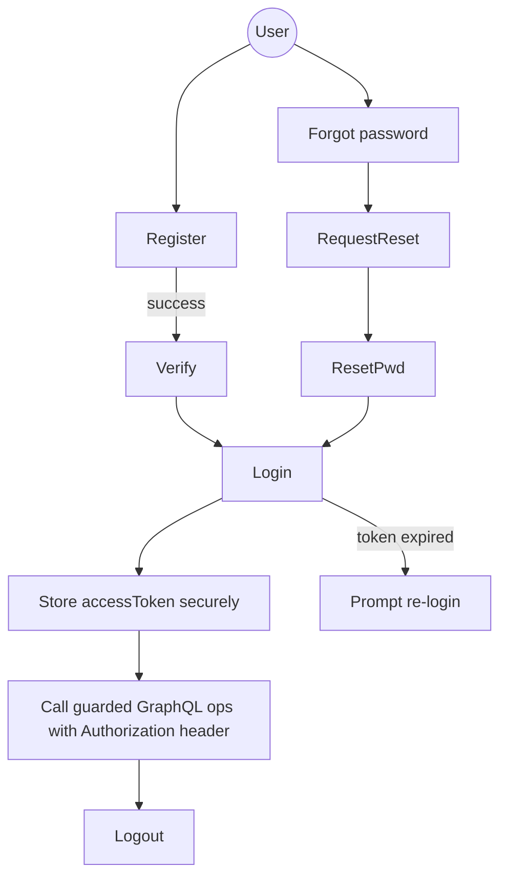

# Auth Frontend Integration Guide

_Last reviewed: 2025-12-04_

This is the handoff for the frontend (AI) team to plug SwiftShip AI's NestJS GraphQL auth module into the web client. It also documents the current readiness and the gaps we still need to close.

## 1. What Works vs Gaps

**Shipping today**
- GraphQL mutations for `register`, `login`, `requestPasswordReset`, `resetPassword`, `changePassword`, `verifyEmail`, `resendVerificationEmail` (`src/auth/auth.resolver.ts`).
- JWT-based guard (`GqlAuthGuard`) backed by `@nestjs/passport` + `JwtStrategy` with configurable `JWT_SECRET` & expiry (`src/auth/auth.module.ts`).
- User creation stores bcrypt-hashed passwords, enforces email + password strength, and tracks `emailVerified`/tokens (`src/auth/auth.service.ts`).
- App-level throttling (`ThrottlerModule`, 120 req/min) + global validation pipe are already on (`src/app.module.ts`, `src/main.ts`).

**Known gaps to plan around**
1. `JwtStrategy.validate` returns `{ userId, email }`, but `RolesGuard` expects `roles` and `AuthResolver.changePassword` looks for `sub`/`id`. Until we fix backend, only rely on `userId` client-side; role-protected resolvers will always deny.
2. `login` still lets legacy accounts sign in without a password (flagged by log warning). Disable this path before production.
3. Email/SMS delivery is stubbed. `register` + `requestPasswordReset` return verification tokens in the response for now; never show them in UI.
4. No refresh tokens/revocation yet. Clients must re-login when the access token expires.
5. There is no explicit check for `emailVerified` in guards; enforce it in the UI for now.

## 2. Endpoint & Headers

- **URL**: `POST https://<api-domain>/graphql`
- **Content-Type**: `application/json`
- **Auth header** (needed for guarded queries/mutations):
  ```http
  Authorization: Bearer <accessToken>
  ```
- **CORS**: backend accepts origins listed in `CORS_ORIGIN` env (comma-separated). Make sure the frontend domain is whitelisted before testing.

## 3. Minimal GraphQL Payloads

All payloads use the standard GraphQL request envelope:
```json
{
  "query": "mutation Login($email:String!, $password:String!) { login(email:$email, password:$password) { accessToken user { id email name emailVerified roles { id name } } } }",
  "variables": { "email": "ops@example.com", "password": "Str0ngPass!" }
}
```

### 3.1 Register → Verify → Login
1. **Register**
   ```graphql
   mutation Register($email:String!, $password:String!, $name:String) {
     register(email:$email, password:$password, name:$name) {
       accessToken
       emailVerificationToken # testing only, hide in UI
       user { id email emailVerified roles { name } }
     }
   }
   ```
2. **Verify email** (call backend after user clicks magic link that your frontend builds)
   ```graphql
   mutation Verify($token:String!) { verifyEmail(token:$token) { message } }
   ```
3. **Login**
   ```graphql
   mutation Login($email:String!, $password:String!) {
     login(email:$email, password:$password) {
       accessToken
       user { id email name emailVerified roles { name } }
     }
   }
   ```
   _Note_: omit `password` only until the backend removes the transition mode.

### 3.2 Authenticated calls
Wrap every guarded query/mutation with the `Authorization` header. Example: change password.
```graphql
mutation ChangePassword($current:String!, $next:String!) {
  changePassword(currentPassword:$current, newPassword:$next) { message }
}
```
The resolver currently looks for `req.user.sub` or `req.user.id`, but `JwtStrategy` only supplies `userId`. Until backend fixes this, call mutations that rely on `context.req.user` through REST fallback or patch backend.

### 3.3 Forgotten password flow
```graphql
mutation RequestReset($email:String!) {
  requestPasswordReset(email:$email) { message }
}
mutation Reset($token:String!, $new:String!) {
  resetPassword(token:$token, newPassword:$new) { message }
}
```
Store `resetToken` only in secure support tooling; it is returned solely because email is not wired yet.

## 4. Client Flow (Mermaid)



Guidelines:
- Save `accessToken` in HTTP-only cookies or secure storage; there is no refresh token yet.
- When `login`/`register` returns `user.emailVerified=false`, keep the user in a "limited" state—some backend resolvers still allow unverified accounts.
- Expect 401/403 for any resolver decorated with `@UseGuards(GqlAuthGuard)` once we fix the payload mismatch. Surface a friendly session-expired banner.

## 5. Error Handling & Observability

- Backend uses Nest `BadRequestException`, `UnauthorizedException`, etc. Surface `graphQLErrors[0].message` to the user and log the stack.
- Global throttler returns `Too Many Requests` (429). Show a retry-after toast if the AI client hammers auth endpoints.
- Include a client-generated `x-request-id` in `extensions` if you want to correlate logs; Nest currently logs to stdout with context tags.

## 6. TODOs for Backend Alignment

1. Update `JwtStrategy.validate` to return `{ id, email, roles }` so `CurrentUser` and `RolesGuard` work.
2. Remove password-optional login path and stop returning verification/reset tokens in responses once email delivery is wired.
3. Add refresh-token issuance + revocation (Redis or Prisma table) so the frontend can silently refresh.
4. Enforce `emailVerified` (either in guard or per resolver) to prevent unverified access.

Until those are done, the GraphQL contract above remains stable and is safe for frontend integration.
