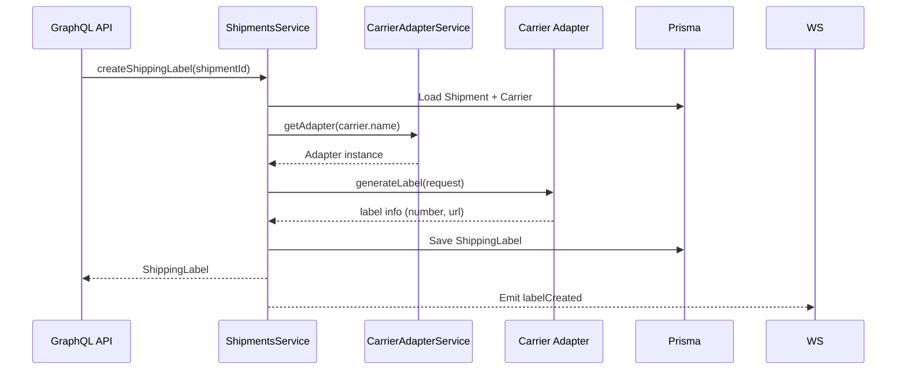

# Carrier Adapter Pattern

We use a simple adapter pattern to support multiple carriers behind a unified API.

- `CarrierAdapterService`: registry for adapters
- `SandboxCarrierAdapter`: default test adapter (code: SANDBOX)
- Real carrier adapters implementing `CarrierAdapter` interface

## Supported Carriers

### 1. SANDBOX (Testing)
- **Code**: `SANDBOX`
- **Description**: Mock carrier adapter for testing and development
- **Configuration**: None required (always available)

### 2. Delhivery
- **Code**: `DELHIVERY`
- **Description**: Delhivery Express - Leading express logistics provider in India
- **Configuration**: 
  - `DELHIVERY_TOKEN`: API token from Delhivery

### 3. Xpressbees
- **Code**: `XPRESSBEES`
- **Description**: Xpressbees Logistics - E-commerce focused logistics provider
- **Configuration**: 
  - `XPRESSBEES_TOKEN`: API token (optional, uses fallback if not provided)

### 4. BlueDart
- **Code**: `BLUEDART`
- **Description**: BlueDart Express - One of India's leading express logistics providers
- **Configuration**: 
  - `BLUEDART_API_KEY`: API key from BlueDart
  - `BLUEDART_LOGIN_ID`: Login ID from BlueDart

### 5. DTDC
- **Code**: `DTDC`
- **Description**: DTDC Express & Logistics - One of India's largest express logistics providers
- **Configuration**: 
  - `DTDC_CLIENT_ID`: Client ID from DTDC
  - `DTDC_API_KEY`: API key from DTDC

### 6. Ecom Express
- **Code**: `ECOM_EXPRESS`
- **Description**: Ecom Express - Leading e-commerce logistics provider in India
- **Configuration**: 
  - `ECOM_EXPRESS_USERNAME`: Username for Ecom Express API
  - `ECOM_EXPRESS_PASSWORD`: Password for Ecom Express API

### 7. Shadowfax
- **Code**: `SHADOWFAX`
- **Description**: Shadowfax - Leading hyperlocal and e-commerce logistics provider
- **Configuration**: 
  - `SHADOWFAX_API_KEY`: API key from Shadowfax
  - `SHADOWFAX_SECRET_KEY`: Secret key from Shadowfax

### 8. FedEx India
- **Code**: `FEDEX_INDIA`
- **Description**: FedEx India - Global logistics provider with strong presence in India
- **Configuration**: 
  - `FEDEX_INDIA_CLIENT_ID`: OAuth client ID
  - `FEDEX_INDIA_CLIENT_SECRET`: OAuth client secret
  - `FEDEX_INDIA_ACCOUNT_NUMBER`: FedEx account number

### 9. Gati
- **Code**: `GATI`
- **Description**: Gati Limited - Leading express logistics and supply chain solutions provider
- **Configuration**: 
  - `GATI_CLIENT_ID`: Client ID from Gati
  - `GATI_API_KEY`: API key from Gati

## Features

All carrier adapters support:
- **Label Generation**: Create shipping labels (PDF/ZPL format)
- **Shipment Tracking**: Real-time tracking updates
- **Shipment Cancellation**: Cancel shipments before pickup
- **Label Voiding**: Void unused labels

## Error Handling

- Retry logic with exponential backoff (3 attempts)
- Graceful fallback for label generation
- Comprehensive error logging
- Client error detection (4xx errors not retried)

## Flow

## Tracking Webhooks
- Expose REST endpoints per carrier to receive tracking updates
- Map payloads to `TrackingEvent`
- Auto-advance `Shipment.status`
- Emit `trackingEvent`
