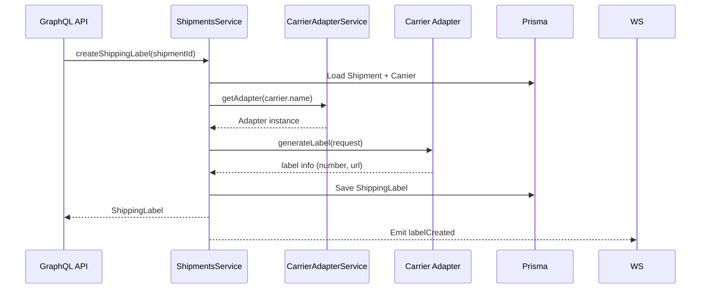

# Carrier Adapter Pattern

We use a simple adapter pattern to support multiple carriers behind a unified API.

- `CarrierAdapterService`: registry for adapters
- `SandboxCarrierAdapter`: default test adapter (code: SANDBOX)
- Add real adapters (e.g., `DelhiveryAdapter`, `XpressbeesAdapter`) implementing `CarrierAdapter`

## Flow

## Tracking Webhooks
- Expose REST endpoints per carrier to receive tracking updates
- Map payloads to `TrackingEvent`
- Auto-advance `Shipment.status`
- Emit `trackingEvent`
