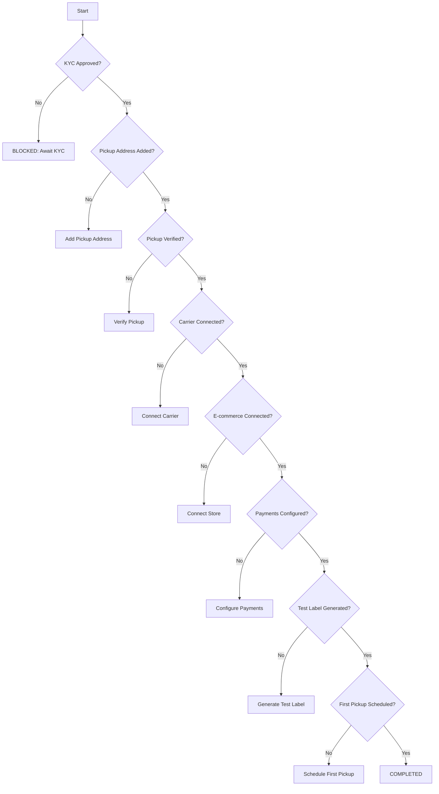

# Onboarding (AOM) Module

This module tracks Account/Onboarding Milestones (AOM) and gates critical flows until required steps are complete.

## Milestones
- KYC submitted and approved
- Pickup address added and verified
- Carrier connected
- E-commerce platform connected
- Payments configured
- Test label generated
- First pickup scheduled

Status auto-computes to NOT_STARTED, IN_PROGRESS, BLOCKED (e.g., KYC pending), or COMPLETED. The `nextAction` gives guidance.

## GraphQL
Queries and mutations:
```graphql
query GetState($userId: Int!) { onboardingState(userId: $userId) { status nextAction blockedReason } }
mutation UpdateState($userId: Int!, $input: UpdateOnboardingInput!) { updateOnboardingState(userId: $userId, updateOnboardingInput: $input) { status nextAction } }
```

## Flowchart


## Guard
`OnboardingGuard` blocks operations when status is BLOCKED. Inject and apply to resolvers as needed.
