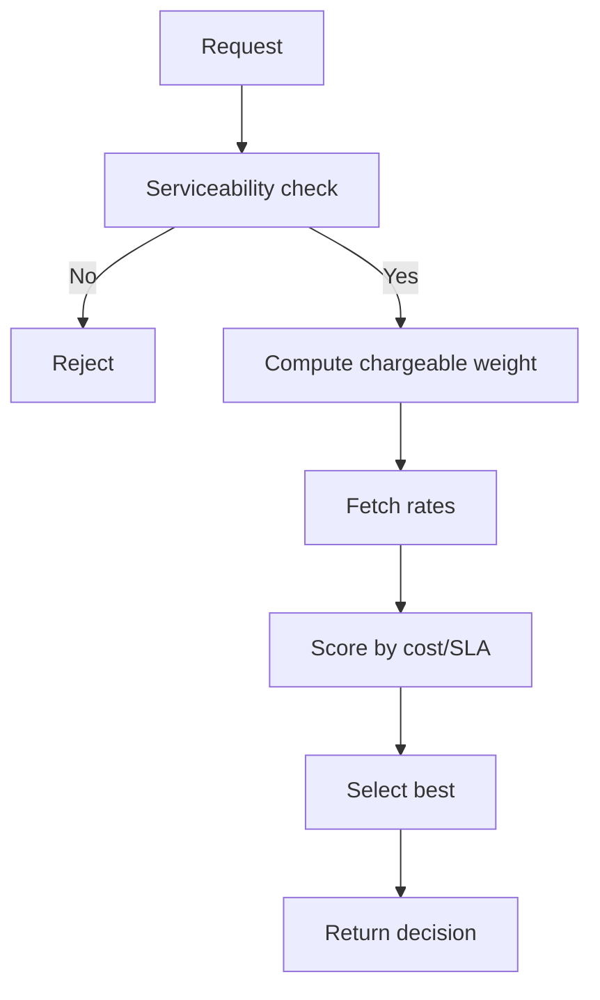

# Rate Shop Engine

Scores available carrier rates using cost and SLA weights, with volumetric weight and serviceability checks. Integrates with `createShippingLabel` to auto-pick best carrier.

## Inputs
- origin/destination pincodes
- weight and dimensions (for volumetric weight)
- preferences: weights for cost vs SLA, preferred carriers

## Flow

