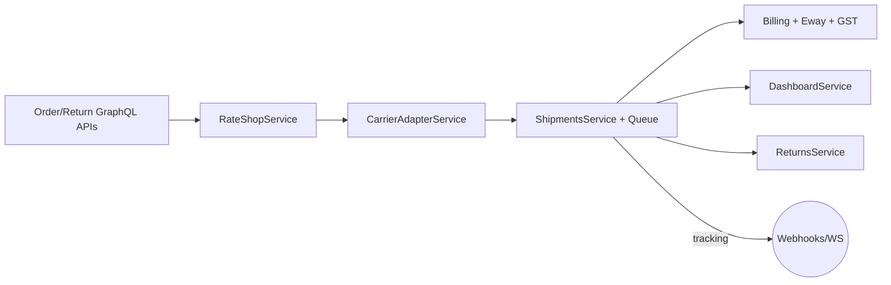

# Logistics MVP Readiness (SwiftShip AI)

_Last reviewed: 2025-12-04_

This note consolidates the current state of the logistics stack (orders → rate shopping → carrier execution → compliance → returns) so we can decide if it satisfies the "mini warehouse + multi-courier" MVP described in the brief.

## Snapshot by Capability

| Domain | Status | Evidence |
| --- | --- | --- |
| Orders & Returns | ✅ Mature | Orders now capture destination addresses, package dims, and warehouse selection; validations live in `src/orders`. |
| Shipments & Tracking | ✅ Mature | `ShipmentsService` ties shipments to warehouses, feeds adapters real package data, and still pushes updates via WebSockets. |
| Carrier Adapters | ✅ (8 prod + sandbox) | `CarrierAdapterService` registers Delhivery, Xpressbees, BlueDart, DTDC, Ecom, Shadowfax, FedEx India, Gati. |
| Rate Shopping | ✅ Warehouse-aware | `RateShopService` consumes real origin/destination pins, volumetric weight, ODA surcharges, and per-warehouse SLA data. |
| Billing / E-Way / GST | ⚠️ Partial | Invoice/E-way services implemented but GSTN + PDF upload still mock/stub. |
| Payments | ⚠️ Partial | Stripe/Razorpay abstractions exist; subscription renewals not wired. |
| Bulk Ops | ✅ Real labels | Batch label generation now calls `ShipmentsService.createLabel` and returns real label URLs. |
| Serviceability & Addressing | ✅ Coverage model | Per-warehouse coverage + ODA metadata live in `WarehouseCoverage`; serviceability service reuses it. |
| Mini Warehouses / Inventory | ⚠️ Partial | `Warehouse`, `WarehouseStock`, `WarehouseCoverage` tables + GraphQL CRUD exist; inventory counts still basic. |
| Automation / Notifications | ⚠️ Partial | Email templates exist, SMS/WhatsApp not integrated, webhook queue exists. |

## Current Fulfilment Flow

- Orders carry destination addresses, package dims, and the selected warehouse (`src/orders/orders.service.ts`).
- Rate shop picks a carrier + rate using real pins/dimensions and warehouse ODA data (`src/rate-shop/rate-shop.service.ts`).
- Carrier adapters abstract nine couriers with retry + fallback (`src/carriers/adapters/*`).
- Shipments manage labels/tracking, attach to warehouses, and a BullMQ worker (`src/queues/workers/label-generator.ts`) emits WebSocket events.
- Compliance layer adds invoices, GST splits, and mock e-way bills (`src/billing`).
- Dashboards aggregate KPIs directly off Prisma (`src/dashboard/dashboard.service.ts`).

## Strengths (MVP-Ready Pieces)

1. **End-to-end happy path** – You can place an order, create a shipment, auto-shop for a carrier, enqueue label generation, ingest tracking, and collect billing artifacts without touching the DB manually.
2. **Carrier breadth** – The adapters already mirror all major Indian couriers Shiprocket uses (Delhivery, BlueDart, DTDC, Ecom Express, Shadowfax, FedEx India, Gati, Xpressbees + sandbox) with retry/backoff.
3. **Operational glue** – Picks, manifests, NDR, COD, returns, webhook dispatcher, and dashboards are wired so ops teams have the same primitives Shiprocket exposes.
4. **Observability hooks** – Metrics service + WebSocket gateway provide enough signals to plug Prometheus/Grafana later.

## Gaps Blocking "Mini Warehouse" MVP

| Gap | Impact | Recommended Action |
| --- | --- | --- |
| Inventory depth per warehouse | We track stock records but no SKU catalogue or allocation rules yet. | Add product catalog + reservation logic so warehouse stock drives auto-allocation. |
| Compliance mocks | GSTN/E-way integrations return placeholders; invoices use hard-coded seller data. | Wire GSTN API + digital signature provider; externalize company profile per warehouse. |
| Security hardening | Most GraphQL logistics resolvers are public; no per-user scoping. | Add `@UseGuards(GqlAuthGuard)` + tenant scoping tied to the authenticated account. |
| Testing coverage | Orders/returns/ecom have specs; shipments, billing, bulk ops, carriers do not. | Add unit tests for `ShipmentsService`, `RateShopService`, `Billing`, `BulkOperations`. |

## Ready for Demo vs Production

- **Demo-ready**: Booking shipments across multiple couriers, ingesting tracking, generating invoices/E-way placeholders, viewing dashboards, and orchestrating warehouse-aware rate shopping.
- **Not yet MVP** for mini warehouses because inventory allocation, SLA-backed promises, and compliance hookups still need polish.

## Immediate Next Steps

1. Layer SKU/inventory reservation logic on top of the new `WarehouseStock` table so we can auto-allocate from the best node.
2. Harden GraphQL security (guards + tenant scoping) before exposing to merchants.
3. Replace GSTN/E-way mocks with real API calls and upload invoices to durable storage (S3/GCS).
4. Extend compliance + notification modules (SMS/WhatsApp) so merchants get parity with Shiprocket automations.

Once these are in place we can confidently call the logistics stack MVP-ready for mini-warehouse orchestration.
