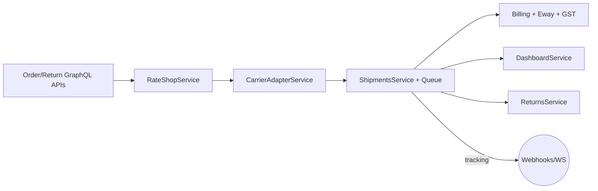

# Logistics MVP Readiness (SwiftShip AI)

_Last reviewed: 2025-12-04_

This note consolidates the current state of the logistics stack (orders → rate shopping → carrier execution → compliance → returns) so we can decide if it satisfies the "mini warehouse + multi-courier" MVP described in the brief.

## Snapshot by Capability

| Domain | Status | Evidence |
| --- | --- | --- |
| Orders & Returns | ✅ Mature | Full CRUD + validation in `src/orders` & `src/returns`, unit tests included. |
| Shipments & Tracking | ✅ Mature | `ShipmentsService` handles life cycle, label queue, tracking ingestion, WebSocket pushes. |
| Carrier Adapters | ✅ (8 prod + sandbox) | `CarrierAdapterService` registers Delhivery, Xpressbees, BlueDart, DTDC, Ecom, Shadowfax, FedEx India, Gati. |
| Rate Shopping | ⚠️ Partial | `RateShopService` ranks carriers but uses placeholder pincodes (`"000000"`) and ignores volumetric metadata from orders. |
| Billing / E-Way / GST | ⚠️ Partial | Invoice/E-way services implemented but GSTN + PDF upload still mock/stub. |
| Payments | ⚠️ Partial | Stripe/Razorpay abstractions exist; subscription renewals not wired. |
| Bulk Ops | ⚠️ Partial | Batch label/pickup flows exist but `generateLabelForShipment` is a stub URL. |
| Serviceability & Addressing | ⚠️ Basic | Only pincode zone table + CRUD; no SLA/cost per zone, no ODA surcharge logic yet. |
| Mini Warehouses / Inventory | ❌ Missing | No `Warehouse`, `Inventory`, or multi-node routing entities in Prisma schema. |
| Automation / Notifications | ⚠️ Partial | Email templates exist, SMS/WhatsApp not integrated, webhook queue exists. |

## Current Fulfilment Flow

- Orders feed shipments with carrier preferences and totals (`src/orders/orders.service.ts`).
- Rate shop picks a carrier + rate (`src/rate-shop/rate-shop.service.ts`) but currently fabricates pincodes and does not look at warehouse stock.
- Carrier adapters abstract nine couriers with retry + fallback (`src/carriers/adapters/*`).
- Shipments manage labels/tracking, and a BullMQ worker (`src/queues/workers/label-generator.ts`) emits WebSocket events.
- Compliance layer adds invoices, GST splits, and mock e-way bills (`src/billing`).
- Dashboards aggregate KPIs directly off Prisma (`src/dashboard/dashboard.service.ts`).

## Strengths (MVP-Ready Pieces)

1. **End-to-end happy path** – You can place an order, create a shipment, auto-shop for a carrier, enqueue label generation, ingest tracking, and collect billing artifacts without touching the DB manually.
2. **Carrier breadth** – The adapters already mirror all major Indian couriers Shiprocket uses (Delhivery, BlueDart, DTDC, Ecom Express, Shadowfax, FedEx India, Gati, Xpressbees + sandbox) with retry/backoff.
3. **Operational glue** – Picks, manifests, NDR, COD, returns, webhook dispatcher, and dashboards are wired so ops teams have the same primitives Shiprocket exposes.
4. **Observability hooks** – Metrics service + WebSocket gateway provide enough signals to plug Prometheus/Grafana later.

## Gaps Blocking "Mini Warehouse" MVP

| Gap | Impact | Recommended Action |
| --- | --- | --- |
| No warehouse/inventory model | Cannot allocate orders to "mini warehouses" or enforce SLA by node. | Add `Warehouse` + `WarehouseStock` tables, associate orders/shipments with source warehouse, extend `RateShopService` to accept origin derived from warehouse. |
| RateShop ignores real shipment data | Decisions use dummy pincodes and constant weight, so multi-node routing + ODA pricing are impossible. | Feed actual order package dims + pickup/delivery pincodes, include surcharge/pincode-zone + SLA scoring. |
| Bulk label generation stub | Batch flow returns fake URLs; ops cannot download consolidated labels. | Replace `generateLabelForShipment` mock with call to `ShipmentsService.createLabel` and stream zipped PDFs. |
| Serviceability only CRUD | Only tracks whether a pincode exists. No transit times, warehouse coverage, or ODA rules. | Extend schema with `zone`, `tatDays`, `odaFee`, and per-warehouse coverage to support mini warehouse planning. |
| Compliance mocks | GSTN/E-way integrations return placeholders; invoices use hard-coded seller data. | Wire GSTN API + digital signature provider; externalize company profile per warehouse. |
| Security hardening | Most GraphQL logistics resolvers are public; no per-user scoping. | Add `@UseGuards(GqlAuthGuard)` + tenant scoping, ensure `RolesGuard` receives roles (JWT payload currently lacks them). |
| Testing coverage | Orders/returns/ecom have specs; shipments, billing, bulk ops, carriers do not. | Add unit tests for `ShipmentsService`, `RateShopService`, `Billing`, `BulkOperations`. |

## Ready for Demo vs Production

- **Demo-ready**: Booking shipments across multiple couriers, ingesting tracking, generating invoices/E-way placeholders, viewing dashboards.
- **Not yet MVP** for mini warehouses because allocation logic, warehouse topology, and SLA-aware rate shopping do not exist.

## Immediate Next Steps

1. Model warehouses, pickup addresses, and inventory capacity in Prisma, then attach them to orders/shipments.
2. Pipe actual shipment dimensions + pincodes into `RateShopService` and carrier adapters instead of hard-coded values.
3. Finish bulk label generation (call real adapter + persist label URLs/binary) and expose zipped download.
4. Harden GraphQL security (guards + tenant scoping) before exposing to merchants.
5. Replace GSTN/E-way mocks with real API calls and upload invoices to durable storage (S3/GCS).

Once these are in place we can confidently call the logistics stack MVP-ready for mini-warehouse orchestration.
